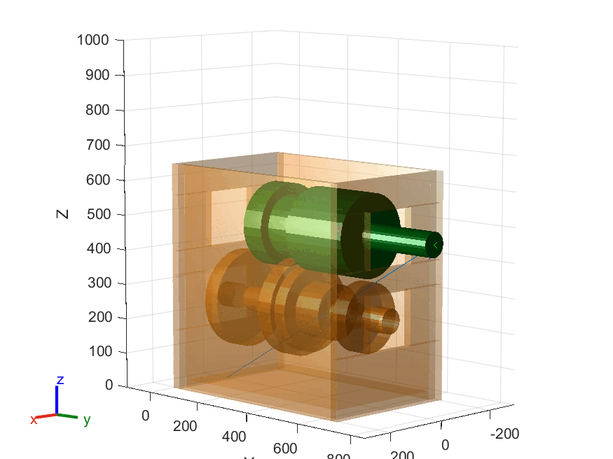
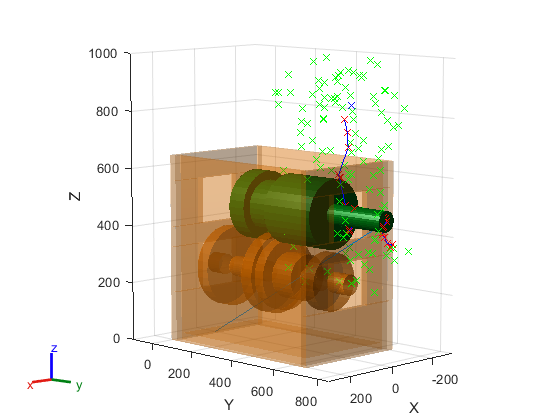

# RRT Planner

This repository contains code implementing an RRT planner. The implementation of the planner focuses on planning a 6-DOF path that removes the mainshaft of a SM-465 transmission out of its housing without colliding with the main case or the installed countershaft. 

## Planner Path

The following shows the path found by the planner to remove the mainshaft.

## RRT Graph

The following shows the tree structure generated while searching for the path. 

## Dependencies

The code was developed in MATLAB 2023 and requires the Robotics Systems Toolbox.

## Run Code

From the `src` directory, open the `.m` file in MATLAB and run the script.